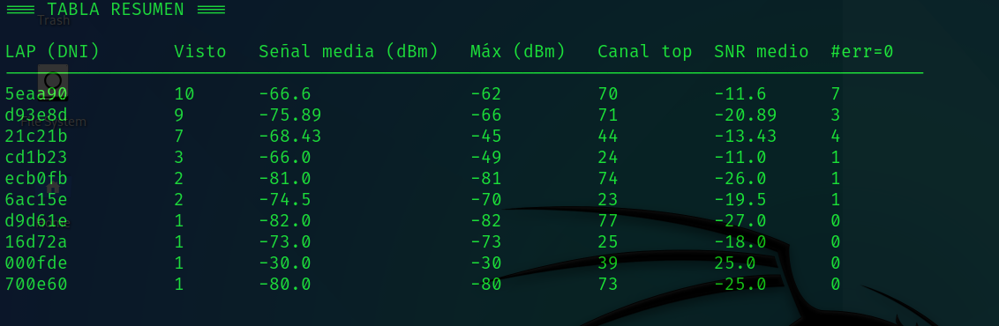

<p align="center">
  <a href="https://github.com/cyberiuscompany/CyUbertoothBreaker">
    
    <strong>Español</strong>
  </a>
  &nbsp;|&nbsp;
  
  <strong>English</strong>
  &nbsp;|&nbsp;
  <a href="https://www.youtube.com/watch?v=xvFZjo5PgG0&list=RDxvFZjo5PgG0&start_radio=1&pp=ygUTcmljayByb2xsaW5nIG5vIGFkc6AHAQ%3D%3D">
    
    <strong>日本語</strong>
  </a>
</p>

# CyUbertoothBreaker
Tool and utilities for **passive analysis** of Bluetooth signals using the "Ubertooth One" hardware for research, authorized auditing and education. It is important to clarify that this hardware and this repository explain how to analyze the traffic, but they **do NOT** launch malicious Bluetooth packets, since the Ubertooth hardware is not designed for that.

---

<p align="center">
  
</p>

---

## Description
**CyUbertooth-Research** is a set of utilities and documentation to **capture and analyze** Bluetooth traffic passively using Ubertooth One and associated tools (Wireshark, BlueZ, etc.). It includes a simple log analyzer (`Analizador_rx_Ubertooth.py`) that extracts summaries by LAP, signal, and quality, helping to prioritize targets for authorized testing.

## 🎥 Demonstration

<p align="center">
  
</p>

---

## Tool Pictures

<h2 align="center">RAW scan of BLE communications</h2>
<p align="center">
  
</p>

<h2 align="center">Processed BLE RAW traffic information, managed and optimized</h2>
<p align="center">
  
</p>

## Hardware Requirements
- **Ubertooth One** (or similar) connected via USB.  
- A Bluetooth HCI adapter (`hci0`) if you also want to run allowed host interaction tests (not included by default).  
- PC with Linux (Kali/Ubuntu/Debian recommended).

<p align="center">
  
</p>

<h5 align="center">Ubertooth One from the creator "https://greatscottgadgets.com/" and available for purchase at https://www.amazon.es/dp/B0D548J1F1</h5>

<p align="center">
  
</p>

<h5 align="center">Ubertooth One connected to my tower computer</h5>

## 🚀 Main Features

- **Automatic LAP summary**: scans an `rx.log` and generates a table sorted with `LAP (ID)`, number of appearances, average signal (dBm), maximum (dBm), most frequent channel, average SNR and count of `err=0`.
- **Detailed samples per LAP**: for each LAP shows up to 10 example lines (timestamp, channel, RSSI, SNR, err) for quick inspection.
- **Tips and simple export**: prints practical recommendations (which LAP to prioritize) and can be easily adapted to export the summary to CSV/JSON.

## 🧰 Technologies Used

- **Python 3** — script compatible with Python 3.x.
- **Standard libraries**: `re`, `collections` (`defaultdict`, `Counter`), `sys`, `os` (no external dependencies).
- **Log format**: designed to process `ubertooth-rx` output (`rx.log` files) with fields like `LAP=`, `s=`, `snr=`, `clkn=`, `err=`.

## 📁 Project Structure

```bash
├── Analizador_rx_Ubertooth.py   # Main script: generates summary and details table from rx.log
├── rx.log                       # Example capture / ubertooth-rx output (for testing)
```
---

## 📄 Additional Documentation

- [🤝 Code of Conduct](.github/CODE_OF_CONDUCT.md)
- [📬 How to Contribute](.github/CONTRIBUTING.md)
- [🔐 Security](.github/SECURITY.md)
- [⚠️ Legal Disclaimer](DISCLAIMER.md)
- [📜 License](LICENSE)
- [📢 Support](.github/SUPPORT.md)

---

## ⚙️ 1.0 First Test with Cloning in 🐧 Kali Linux

```bash
# 1. Check that the USB device is connected
lsusb

# 2. Update Firmware (Not required if detected with "lsusb")
sudo ubertooth-dfu -d firmware.dfu

# 3. Install resources on Kali Linux
sudo apt install ubertooth
ls -l /usr/bin/ubertooth

# 4. Ubertooth-rx - Listen to traffic
sudo ubertooth-rx # BTL communication protocol in RAW
sudo timeout 300 ubertooth-rx -z > rx.log # Generate rx.log file with traffic captured during 300 seconds (10m)
watch -n1 cat rx.log # See in real time how the log file fills with information

# 5. Finally analyze the rx.log file
https://github.com/cyberiuscompany/CyUbertoothBreaker.git
cd CyUbertoothBreaker
python3 Analizador_rx_Ubertooth.py rx.log
```

## ⚙️ 2.0 Second Test searching for the FHS

If you already tried step 1.0, now you must find the FHS, which is like the handshake between two Bluetooth devices (when one device connects to another). If you succeed, you might see the full original MACs of each device to move on to more complex tests—normally you can only see the last 3 pairs (the LAP). To understand, look at the following diagram and compare with the image.

<p align="center">
  
</p>

```bash
BD_ADDR = [ B5 B4 ] : [ B3 ] : [ B2 B1 B0 ]
         ^^^^^^      ^^^     ^^^^^^^^^^^
         NAP (2 bytes)  UAP (1)   LAP (3 bytes)

Indexes (left to right, as printed AA:BB:CC:DD:EE:FF):

- B5 = first byte, B4 = second byte → NAP (2 bytes)
- B3 = third byte → UAP (1 byte)
- B2 B1 B0 = last three bytes → LAP (3 bytes)

# To obtain an FHS, normally try the following:

sudo timeout 3600 ubertooth-rx -z > rx.log # Run a much longer scan (1 hour)
grep -Eio '([0-9a-f]{2}:){5}[0-9a-f]{2}' rx_long.log | sort | uniq -c | sort -nr # Search for full MACs (colon format)
grep -Eio '\b[0-9a-f]{12}\b' rx_long.log | sort | uniq -c | sort -nr # Search for full MACs in continuous format (no :)
```

As you can see, getting the LAP is easy—just run Ubertooth One to scan. The hard part is obtaining a full MAC to know the MAC vendor, but if you run a long scan you may encounter a case like the following (you must stop scanning to see that part of the "Survey Results" in the log):

<p align="center">
  
</p>

Here the Ubertooth One captured a UAP from a handshake in the air. This indicates that the environment I audited used a secure BLE protocol version, because otherwise it would have returned the full MAC if BLE were insecure.

## ⚙️ 3.0 Using Wireshark for BLE (Easy Path)

If you already tried the previous steps, you have experienced low-level technical analysis of the BLE protocol and its traffic. Now, with Wireshark you can view the traffic in a decoded form (not RAW) to learn about devices in the environment. Follow the commands and the video tutorial below.

```bash
# Let's create a file to which the Ubertooth One will send its scanned data called "ubertooth.pipe"
rm -f ./ubertooth.pipe
mkfifo ./ubertooth.pipe
chmod 777 ./ubertooth.pipe
ls -l ./ubertooth.pipe

# With the file created, run the following command only if Wireshark is configured to read it.
sudo ubertooth-btle -f -c ./ubertooth.pipe # BTLE protocol live interpreted (not RAW)
```
<p align="center">
  
</p>

As you can see, two things must be configured properly:

- Capture -> Options -> Manage Interfaces -> Pipes -> Add -> File Path "ubertooth.pipe"
- Edit -> Preferences -> Protocols -> DLT_USER -> Edit -> DLT=147 + Payload dissected=btle

After editing Wireshark, run the command to scan the BLE protocol with the Ubertooth One.

## ⚙️ ---------- END ----------

In my case this is the maximum I have seen that the hardware offers, so it remains a simple traffic analysis tool that can reach protocol level. If we wanted to launch attacks (not just listen to traffic), different hardware would be needed.

<p align="center">
  
</p>

I include my face here because I am the first Hispanic person who published an in-depth Spanish article about the "Ubertooth One" hardware, contributing a small piece to the community.

Greetings!!!
