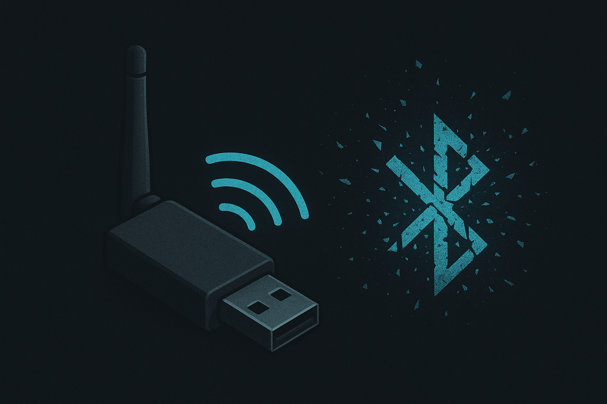
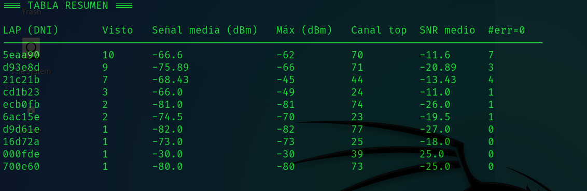

<p align="center">
  
  <strong>Español</strong>
  &nbsp;|&nbsp;
  <a href="README.en.md">
    
    <strong>English</strong>
  </a>
  &nbsp;|&nbsp;
  <a href="https://www.youtube.com/watch?v=xvFZjo5PgG0&list=RDxvFZjo5PgG0&start_radio=1&pp=ygUTcmljayByb2xsaW5nIG5vIGFkc6AHAQ%3D%3D">
    
    <strong>日本語</strong>
  </a>
</p>

# CyUbertoothBreaker
Herramienta y utilidades para **análisis pasivo** de señales Bluetooth con el Hardware "Ubertooth One" para investigación, auditoría autorizada y educación, importante recalcar que este Hardware y este repositorio, explica como análizar el tráfico, pero "NO" se lanza paquetes Bluethood maliciosos, dado que el Hardware Ubertooth, no esta diseñado para ello.

---

<p align="center">
  
</p

---

## Descripción
**CyUbertooth-Research** es un conjunto de utilidades y documentación para **capturar y analizar** tráfico Bluetooth de forma pasiva usando Ubertooth One y herramientas asociadas (Wireshark, BlueZ, etc.), la cual incluye un analizador sencillo de logs (`Analizador_rx_Ubertooth.py`) que extrae resúmenes por LAP, señal y calidad, y ayuda a priorizar objetivos para pruebas autorizadas.

## 🎥 Demostración

<p align="center">
  
</p>

---

## Fotos de Herramienta

<h2 align="center">Escaneo en RAW de comunicaciones BLE</h2>
<p align="center">
  
</p>

<h2 align="center">Información tratada de tráfico RAW BLE, gestionada y optimizada</h2>
<p align="center">
  
</p>

## Requisitos de hardware
- **Ubertooth One** (o similar) conectado por USB.  
- Un adaptador Bluetooth HCI (`hci0`) si también quieres realizar pruebas permitidas que requieran interacción con el host (no incluido por defecto).  
- PC con Linux (Kali/Ubuntu/Debian recomendado).

<p align="center">
  
</p>

<h5 align="center">Ubertooth One del creador "https://greatscottgadgets.com/" y pudiendose comprar en https://www.amazon.es/dp/B0D548J1F1</h5>

<p align="center">
  
</p>

<h5 align="center">Ubertooth One conectado a mi ordenador tipo Torre</h5>

## 🚀 Funcionalidades principales

- **Resumen automático de LAPs**: escanea un `rx.log` y genera una tabla ordenada con `LAP (DNI)`, número de apariciones, señal media (dBm), máximo (dBm), canal más frecuente, SNR medio y recuento de `err=0`.
- **Muestras de detalle por LAP**: para cada LAP muestra hasta 10 líneas de ejemplo (timestamp, canal, RSSI, SNR, err) para inspección rápida.
- **Consejos y exportación simple**: imprime recomendaciones prácticas (qué LAP priorizar) y permite fácilmente adaptar el script para exportar el resumen a CSV/JSON.

## 🧰 Tecnologías utilizadas

- **Python 3** — script compatible con Python 3.x.
- **Librerías estándar**: `re`, `collections` (`defaultdict`, `Counter`), `sys`, `os` (sin dependencias externas).
- **Formato de logs**: pensado para procesar la salida de `ubertooth-rx` (ficheros `rx.log`) con campos como `LAP=`, `s=`, `snr=`, `clkn=`, `err=`.

## 📁 Estructura del proyecto

```bash
├── Analizador_rx_Ubertooth.py   # Script principal: genera tabla resumen y detalles a partir de rx.log
├── rx.log                       # Ejemplo de captura / salida de ubertooth-rx (Para pruebas)
```
---

## 📄 Documentación adicional

- [🤝 Código de Conducta](.github/CODE_OF_CONDUCT.md)
- [📬 Cómo contribuir](.github/CONTRIBUTING.md)
- [🔐 Seguridad](.github/SECURITY.md)
- [⚠️Aviso legal](DISCLAIMER.md)
- [📜 Licencia](LICENSE)
- [📢 Soporte](.github/SUPPORT.md)

---

## ⚙️ 1.0 Primer Ataque con Clonado en 🐧Kali Linux

```bash
# 1. Comprobar el que el USB se encuentre conectado
lsusb

# 2. Actualizar Firmware (No es Obligatorio si con "lsusb" ha sido detectado)
sudo ubertooth-dfu -d firmware.dfu

# 3. Instalación de Recursos sobre Kali Linux
sudo apt install ubertooth
ls -l /usr/bin/ubertooth

# 4. Ubertooth-rx - Escuchar Tráfico
sudo ubertooth-rx # Comunicación BTL del Protocolo en Raw
sudo timeout 300 ubertooth-rx -z > rx.log # Generar el Fichero rx.log con el tráfico capturado durante 300 Segundos(10m)
watch -n1 cat rx.log # Con este comandos puedes ver en vivo como se va rellenando el fichero de información

# 5. Finalmmente analizar el fichero rx.log
https://github.com/cyberiuscompany/CyUbertoothBreaker.git
cd CyUbertoothBreaker
python3 python3 Analizador_rx_Ubertooth.py rx.log
```

## ⚙️ 2.0 Segundo Ataque buscando el FHS

Si ya probaste el punto 1.0, te toca, ahora, hallar el FHS, que es como el Handshake entre dos dispositivos Bluethood (Cuando un dispositivo Bluethood se conectada con otro), si lo consigues, podrías ver las MACs originales completas de cada dispositivo para avanzar a ataques mas complejos, dado que de normal, solo puedes ver las 3 ultimas parejas (Es decir, el LAP), para que se entienda mira el siguiente diagrama y compara con la imagen.

<p align="center">
  
</p>

```bash
BD_ADDR = [ B5 B4 ] : [ B3 ] : [ B2 B1 B0 ]
         ^^^^^^      ^^^     ^^^^^^^^^^^
         NAP (2 bytes)  UAP (1)   LAP (3 bytes)

Índices (de izquierda a derecha, como en impresión AA:BB:CC:DD:EE:FF):

- B5 = primer byte, B4 = segundo byte → NAP (2 bytes)
- B3 = tercer byte → UAP (1 byte)
- B2 B1 B0 = últimos tres bytes → LAP (3 bytes)

# Para conseguir un FSH, lo normal es probar lo siguiente:

sudo timeout 3600 ubertooth-rx -z > rx.log # Aquí se lanza un escaneo bastante mas largo (1 Hora)
grep -Eio '([0-9a-f]{2}:){5}[0-9a-f]{2}' rx_long.log | sort | uniq -c | sort -nr # Busca MACs completas (formato con dos puntos)
grep -Eio '\b[0-9a-f]{12}\b' rx_long.log | sort | uniq -c | sort -nr # Busca MACs completas con formato continuo (sin :)
```
Como ves, tener el LAP es algo sencillo, es lanzar el "Ubertooth One" a escanear, lo díficil es conseguir una MAC entera para conocer el "MAC Vendor", pero bueno, aun así, si lanzas un escaneo largo, se pueden presentar un caso como el siguiente (tienes que parar de escanear (Ctrl+C) para ver en el fichero de log, esa parte de "Survey Results"):

<p align="center">
  
</p>

Como ves aquí me recogio el "Ubertooth One" un UAP de un Handshake que estaba en el aire, lo bueno que me dice esto, es que, usan, en esa empresa un versión de protocolo BLE altamente segura, porque de lo contrario, me devolveria la MAC completa si el protocolo BLE seria inseguro.

## ⚙️ 3.0 Usando de WireShark para BLE (Camino Fácil)

Continuando, si ya has probado los pasos anteriores, eso significa que has vivido la experencia, de hacer al más bajo nivel, un análisis técnico del protocolo BLE y su tráfico, en cambio, ahora ya finalmente con Wireshark, se puede mirar el tráfico en el aire con leyendo los paquetes que no estaran en RAW, sino embebidos para conocer un poco los dispositivos que hay en el ambiente, para ello, sigue los comandos junto con el video tutorial, de debajo.

```bash
# Vamos a crear un fichero al cual se va enviar los datos que escanee el "Ubertooth One" llamado el fichero "ubertooth.pipe"
rm -f ./ubertooth.pipe
mkfifo ./ubertooth.pipe
chmod 777 ./ubertooth.pipe
ls -l ./ubertooth.pipe

# Con el fichero creado, habria que ejecutar el siguiente comando, pero solo, si previamente tenemos el wireshark configurado para que lo pueda leer.
sudo ubertooth-btle -f -c ./ubertooth.pipe # Comunicación BTLE del Protocolo Interpretada en Vivo (No RAW)
```
<p align="center">
  
</p>

Como ves hay que configurar 2 cosas bien claras:

- Captura -> Options -> Manage Interfaces -> Pipes -> Añadir -> Path Fichero "ubertooth.pipe"
- Edit -> Preferences -> Protocols -> DLT_USER -> Edit -> DLT=147 + Payload dissecto=btle

Y una vez las ediciones/modificaciones en Wireshark, es la hora, de lanzar el commando para escanear el protocol BLE con el "Ubertooth One".

## ⚙️ ---------- FIN ----------

En mi caso esto es lo máximo que yo he visto que ofrece el Hardware, asi que, no deja de ser un sencillo analizar de tráfico, con el cual puedes llegar a romper el tráfico, dado que trabaja hasta un nivel de protocolo, en cambio, si quisieramos lanzar ataques, no solo escuchar tráfico, habría que cambiar de hardware.

